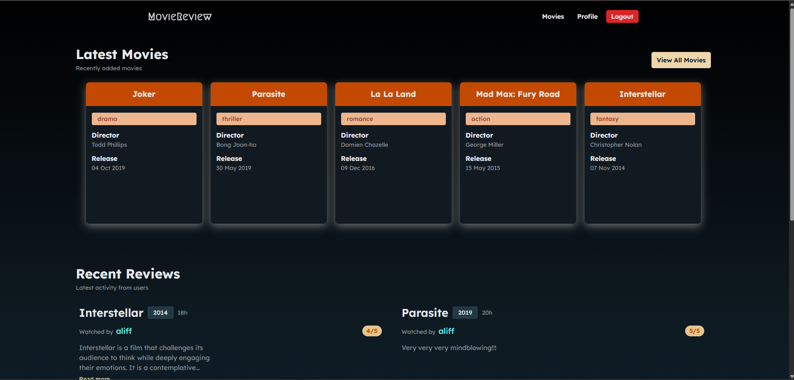
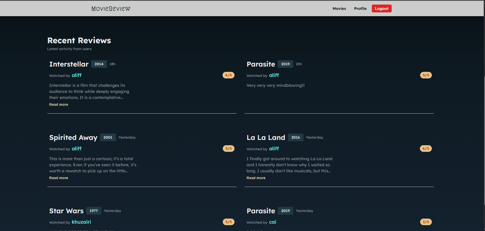
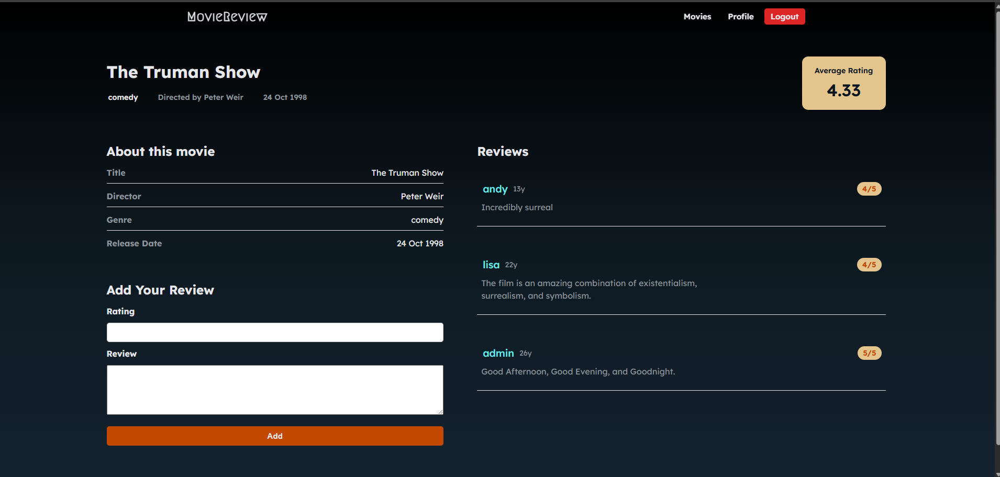
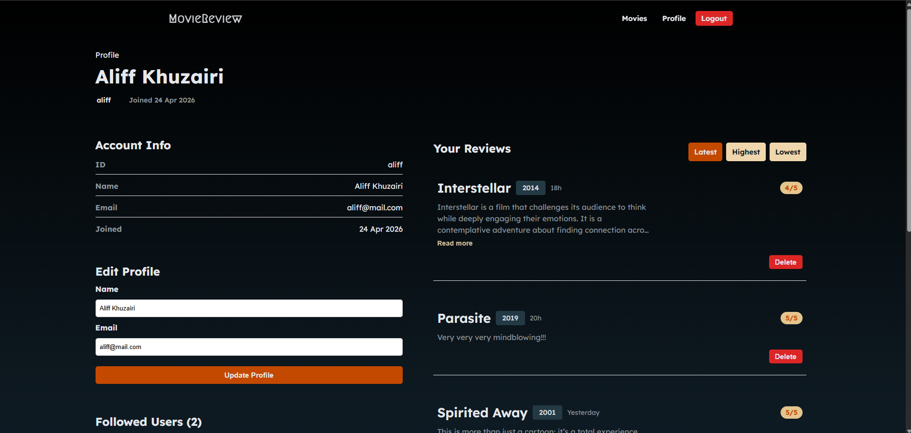
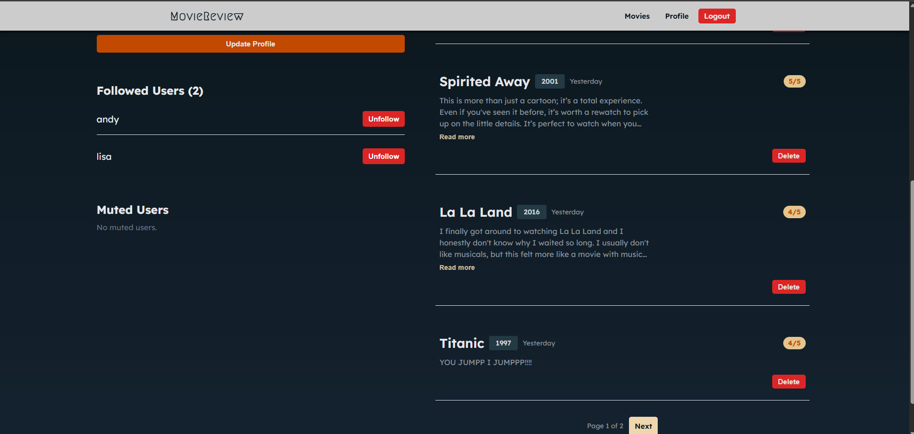
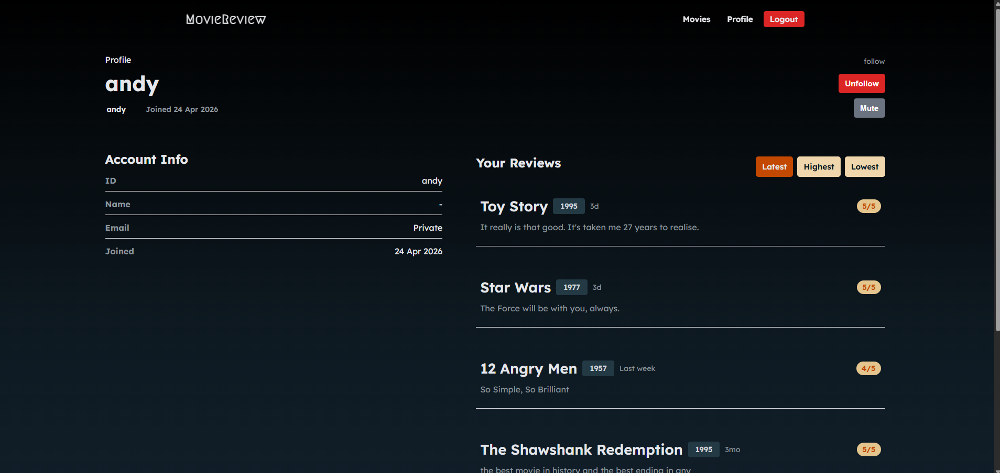
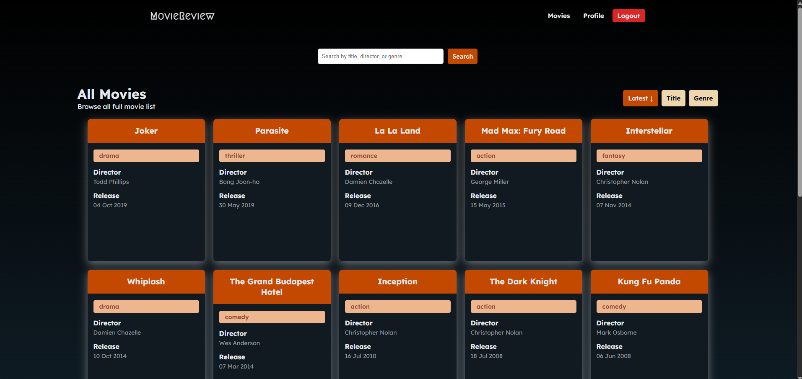
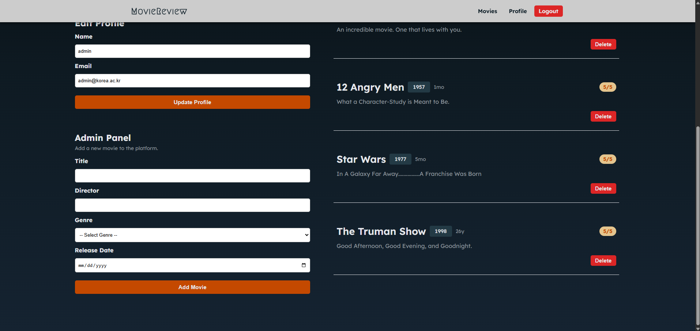

# MovieReview — Flask Movie Review Web App

MovieReview is a full-stack Flask web app where users can browse movies, post reviews, manage their profile, and interact with other users through follow and mute features.

The project focuses on backend CRUD, PostgreSQL relationships, authentication, responsive UI, and user-focused features.

---

### Home Page



### Movie Details Page


### User Profile Page




### All Movies Page


### Admin Panel


---

## Features

### Authentication
- User sign up and login
- Password hashing for new accounts
- Session-based authentication
- Role-based admin access

### Movies
- Browse all movies
- Search by title, director, or genre
- Sort by latest, title, and genre
- Admin can add new movies
- Duplicate movie handling

### Reviews
- Add, update, and delete reviews
- Rating validation from 0 to 5
- Relative time display such as `5m`, `1h`, and `23y`
- Review sorting by latest, highest, and lowest rating
- Review pagination on profile pages

### User Profiles
- View user information
- Edit name and email
- View review history
- View followed users
- Muted users are private to the current user

### Social Features
- Follow users
- Mute users to hide their reviews
- Prevent users from following or muting themselves
- Prevent follow/mute actions on admin profiles

### UI/UX
- Dark theme
- Responsive layout
- Mobile navigation toggle
- Font Awesome icons
- Card-based movie and review layout

---

## Tech Stack

### Backend
- Python (Flask)
- PostgreSQL
- psycopg2
- Werkzeug password hashing

### Frontend
- HTML5
- CSS3 (Flexbox + responsive design)
- JavaScript (vanilla)
- Font Awesome (icons)

---

## Database

The app uses PostgreSQL with relational tables for:

- users
- user_info
- movies
- reviews
- ties

Key relationships:
- A user can review a movie once.
- A user can follow or mute another user.
- Movies use auto-generated integer IDs.

---

## Project Structure

```bash
.
├── app.py
├── templates/
│ ├── base.html
│ ├── home.html
│ ├── movies.html
│ ├── movie.html
│ ├── user_info.html
│ ├── login.html
│ └── signup.html
├── static/
│ ├── style.css
│ └── script.js
├── movie_db.sql
└── README.md
```

---

## Setup Instructions

### 1. Clone the repository

```bash
git clone https://github.com/aliffkhuzairi/flask_movie_review_v2.git
cd flask_movie_review_v2
```

---

### 2. Create virtual environment

```bash
python -m venv .venv
```

Activate:

**Windows**

```bash
.venv\Scripts\activate
```

**Mac/Linux**

```bash
source .venv/bin/activate
```

---

### 3. Install dependencies

```bash
pip install flask psycopg2-binary
```

---

### 4. Setup PostgreSQL

Create database:

```bash
CREATE DATABASE movie_review;
```

Import schema:

```bash
psql -U postgres -d movie_review -f movie_db.sql
```

---

### 5. Configure environment variable

Set your database password:

**Windows**

```bash
set DB_PASSWORD=yourpassword
```

**Mac/Linux**

```bash
export DB_PASSWORD=yourpassword
```

---

### 6. Run the application

```bash
python app.py
```

Open in browser:

```bash
http://127.0.0.1:5000
```

---

## Responsive Design

- Desktop → multi-column layout
- Tablet → 2-column layout
- Mobile → stacked layout
- Navigation menu with toggle icon

---

## Security Notes

- Database credentials are loaded from environment variables.
- Passwords are hashed for new users.
- SQL queries use parameterized statements.
- Admin-only features are protected by role checks.

---

## What I Learned

- Building Flask routes for authentication, profiles, movies, and reviews
- Designing PostgreSQL relationships and constraints
- Handling user sessions and role-based access
- Writing safer SQL queries with parameters
- Improving UI with responsive layouts and reusable CSS
- Managing feature growth through refactoring

---

## Future Improvements

- Add movie posters using an external API
- Add star-based rating UI
- Add movie detail editing for admins
- Add deployment support
- Split routes into blueprints

---

## Author

**Aliff Khuzairi bin Jamaludin**  
Computer Science & Engineering Graduate  
Korea University, Seoul

---

## License

This project is for educational purposes.
