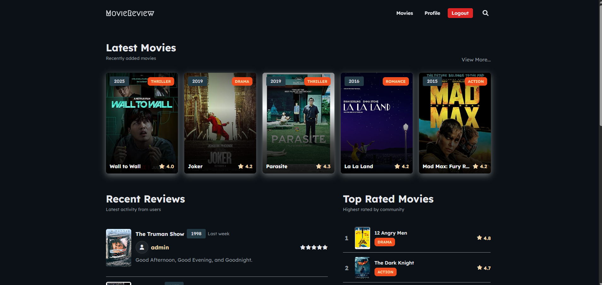
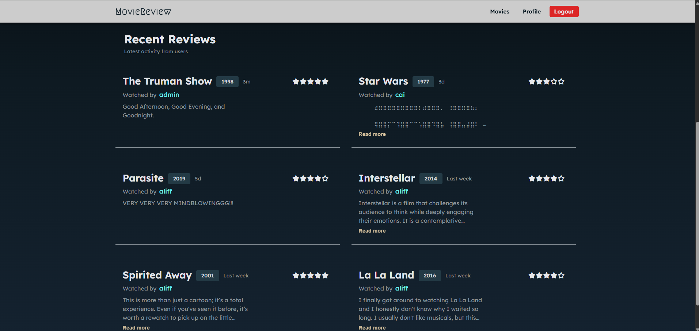
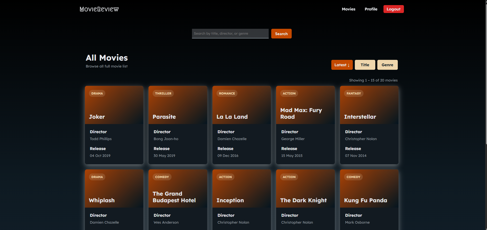
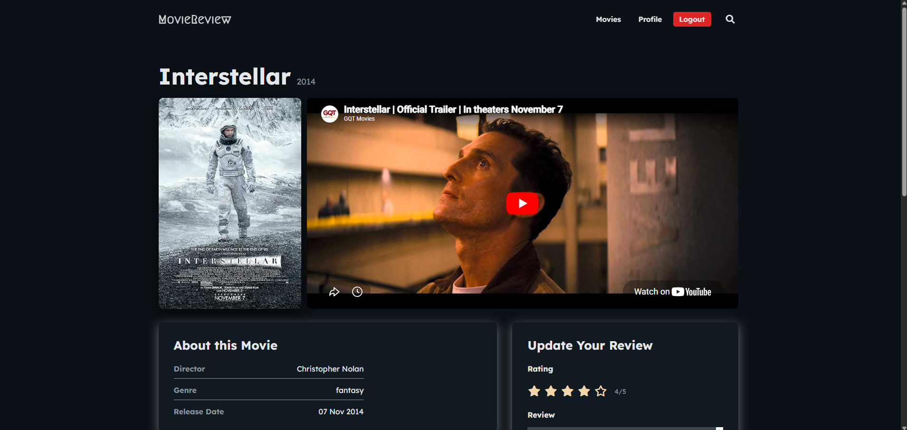
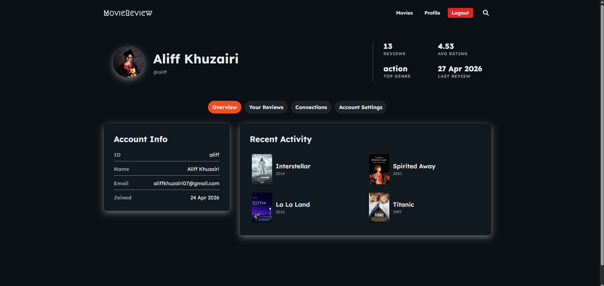
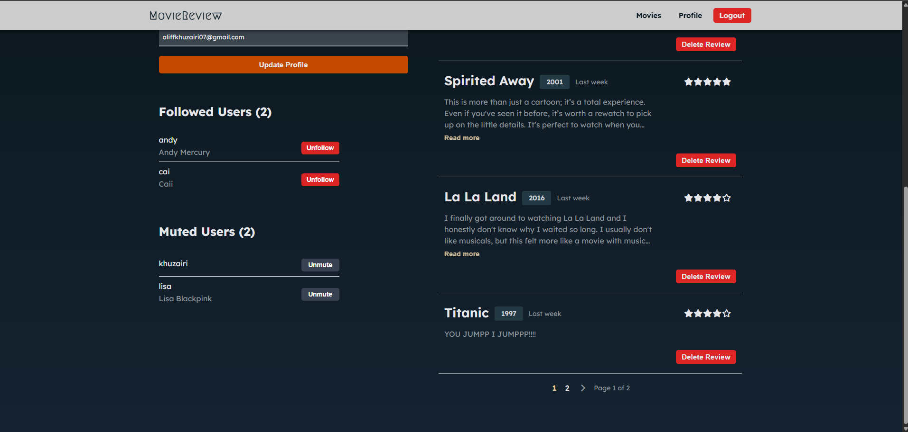
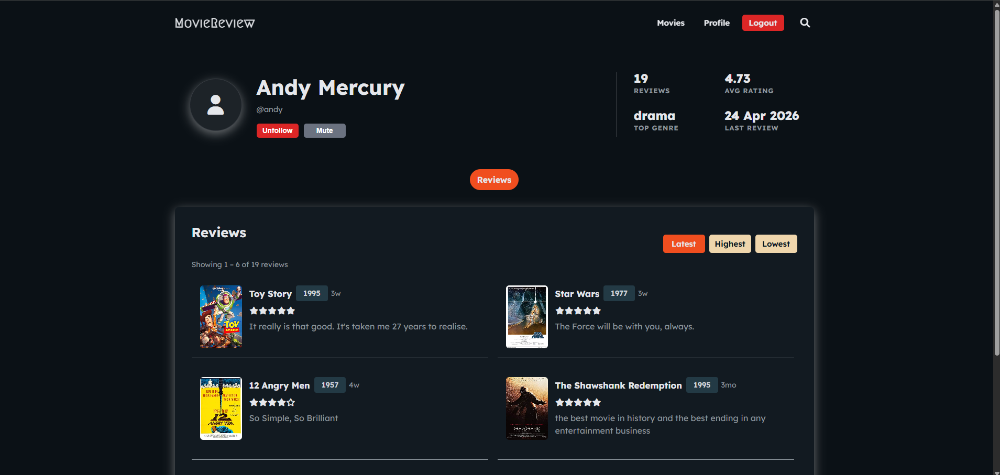
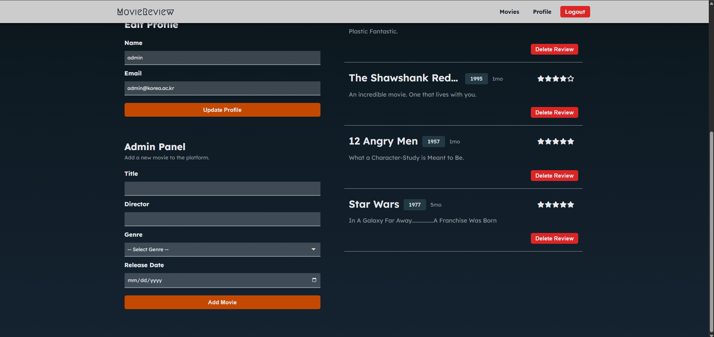
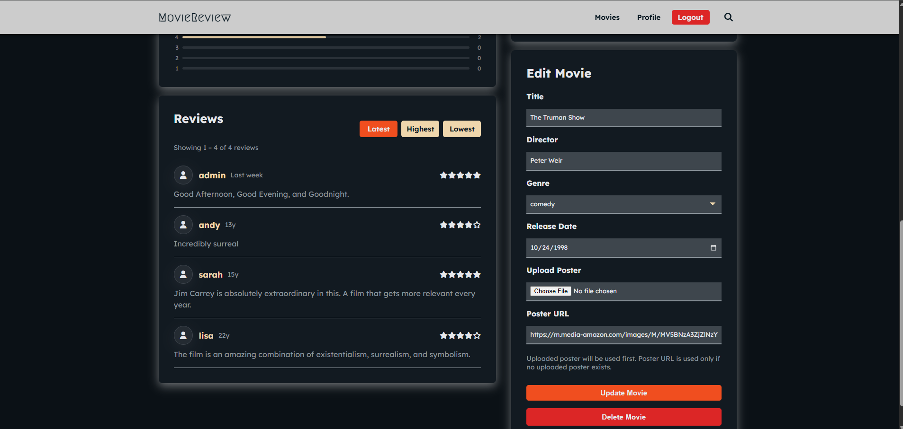

# MovieReview — Flask Movie Review Web App

MovieReview is a full-stack Flask web app where users can browse movies, post reviews, manage their profile, and interact with other users through follow and mute features.

The project focuses on backend CRUD, PostgreSQL relationships, authentication, responsive UI, and user-focused features.

---

### Home Page



### All Movies Page


### Movie Details Page


### User Profile Page




### Admin Panel



---

## Features

### Authentication
- User sign up and login
- Password hashing for new accounts
- Session-based authentication
- Protected route for logged-in users
- Role-based admin access

### Movies
- Browse all movies
- Search movies by title, director, or genre
- Sort movies by latest, title, and genre
- Paginated movie list
- Result summary such as `Showing 1 – 15 of 21 movies`
- Admin can add new movies
- Admin can update movie details
- Admin can delete movies
- Duplicate movie handling

### Reviews
- Add, update, and delete reviews
- Star-based rating input UI
- Rating validation from 1 to 5
- Average rating display on movie detail pages
- Rating breakdown chart for each movie
- Relative time display such as `5m`, `1h`, and `2d`
- Sort reviews by latest, highest rating, and lowest rating
- Paginated reviews on user profile pages
- Paginated reviews on movie detail pages
- Review count summary such as `Showing 1 – 5 of 12 reviews`

### Global Search
- Header search for movies and users
- Search result page with filter tabs for all results, movies, and people
- People search results include user avatars
- Search layout is responsive across desktop, tablet, and mobile

### User Profiles
- View user profile information
- Profile dashboard with tabs for overview, reviews, connections, and account settings
- User review stats including total reviews, average rating given, top genre, and latest review date
- Upload and crop profile avatar using Cropper.js
- Remove uploaded avatar and fall back to default icon avatar
- Edit name and email
- Change password from account settings
- Delete own account with double confirmation
- Account deletion removes profile data, reviews, avatar, and social connections
- View review history
- Sort user reviews
- View followed users
- Muted users are private to the current user

### Social Features
- Follow users
- Mute users to hide their reviews
- Prevent users from following or muting themselves
- Prevent follow/mute actions on admin profiles
- Hide reviews from muted users on home and movie detail pages

## Admin Features
- Add new movies
- Update existing movies
- Delete movies and related reviews
- Admin-only role checks
- Admin profile protection from follow/mute actions

### UI/UX
- Dark theme
- Responsive layout for desktop, tablet, and mobile
- Mobile navigation toggle
- Header search toggle
- Font Awesome icons
- Card-based movie and review layout
- Clickable review cards while keeping inner links and buttons usable
- Password visibility toggle for login, signup, and password change forms
- Custom confirmation modals instead of browser default confirmation dialogs
- Anchor navigation for review sorting on smaller screens
- Reusable pagination styling

---

## Tech Stack

### Backend
- Python (Flask)
- PostgreSQL
- psycopg2
- Werkzeug password hashing

### Frontend
- HTML5
- CSS3 (Flexbox + responsive design)
- JavaScript (vanilla)
- Font Awesome (icons)
- Cropper.js for avatar cropping

---

## Database

The app uses PostgreSQL with relational tables for:

- users
- user_info
- movies
- reviews
- ties

Key relationships:
- A user can review a movie once.
- A user can follow or mute another user.
- Muted users’ reviews are hidden from the current user.
- Movies use auto-generated integer IDs.

---

## Project Structure

```bash
.
├── app.py
├── db.py
├── utils.py
├── routes/
│   ├── __init__.py
│   ├── auth_routes.py
│   ├── movie_routes.py
│   ├── search_routes.py
│   └── user_routes.py
├── templates/
│   ├── partials/
│   │   └── header.html
│   ├── macros.html
│   ├── home.html
│   ├── movies.html
│   ├── movie.html
│   ├── search.html
│   ├── user_info.html
│   ├── login.html
│   └── signup.html
├── static/
│   ├── style.css
│   ├── script.js
│   └── uploads/
│       └── avatars/
│           └── .gitkeep
├── screenshots/
├── movie_db.sql
├── .gitignore
└── README.md
```

---

## Setup Instructions

### 1. Clone the repository

```bash
git clone https://github.com/aliffkhuzairi/flask_movie_review_v2.git
cd flask_movie_review_v2
```

---

### 2. Create virtual environment

```bash
python -m venv .venv
```

Activate:

**Windows**

```bash
.venv\Scripts\activate
```

**Mac/Linux**

```bash
source .venv/bin/activate
```

---

### 3. Install dependencies

```bash
pip install flask psycopg2-binary
```

---

### 4. Setup PostgreSQL

Create database:

```bash
CREATE DATABASE movie_review;
```

Import schema:

```bash
psql -U postgres -d movie_review -f movie_db.sql
```

---

### 5. Configure environment variable

Set your database password:

**Windows**

```bash
set DB_PASSWORD=yourpassword
```

**Mac/Linux**

```bash
export DB_PASSWORD=yourpassword
```

---

### 6. Run the application

```bash
python app.py
```

Open in browser:

```bash
http://127.0.0.1:5000
```

---

## Responsive Design

- Desktop → multi-column layout
- Tablet → 2-column layout
- Mobile → stacked layout
- Navigation menu with toggle icon
- Review and movie cards resize across screen widths

---

### Security Notes

- Database credentials are loaded from environment variables.
- Passwords are hashed for new users.
- SQL queries use parameterized values.
- Dynamic sort values are restricted through allowlists.
- Admin-only features are protected by role checks.
- User actions are guarded with session checks.
- Delete actions use POST requests instead of GET links.
- Uploaded avatar files are ignored by Git and stored locally during development.
- Avatar uploads are processed as cropped image data before saving.
- Password change requires the current password.
- Account deletion requires password confirmation and `DELETE` text confirmation.
- Admin accounts cannot be deleted from the settings page.
- Destructive actions use custom confirmation modals before submitting POST requests.

---

## What I Learned

- Building Flask routes with blueprints
- Registering route modules through routes/__init__.py
- Handling authentication and user sessions
- Designing PostgreSQL relationships and constraints
- Writing SQL queries with joins, filters, sorting, pagination, and NOT EXISTS
- Implementing role-based access for admin features
- Building reusable Jinja macros
- Building interactive form inputs with vanilla JavaScript
- Refactoring pagination logic into helper functions
- Improving mobile layout with responsive CSS
- Managing UI growth through CSS restructuring
- Handling account deletion with related database cleanup
- Managing user-uploaded files and deleting old avatar files
- Building modal confirmation flows with JavaScript
- Creating reusable custom confirmation modals
- Replacing inline click handlers with JavaScript event listeners
- Managing clickable cards with overlay links while preserving inner button and link behavior
- Adding password visibility toggles for authentication forms

---

## Future Improvements

- Add movie posters using an external API
- Add full deployment support
- Add automated tests
- Add CSRF protection for forms
- Store uploaded images in cloud storage for production

---

## Author

**Aliff Khuzairi bin Jamaludin**  
Computer Science & Engineering Graduate  
Korea University, Seoul

---

## License

This project is for educational purposes.
